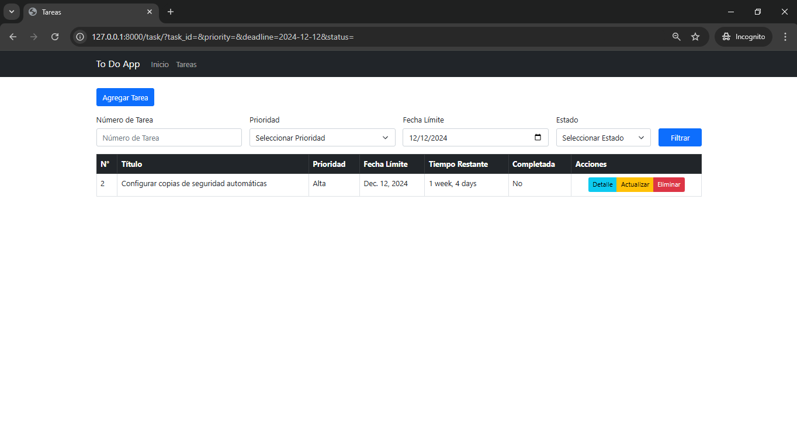

<p align="center">
  
</p>
 
         

# Gestión de Tareas con Django
Una aplicación web para gestionar tareas personales, diseñada para simplificar la organización y la productividad.
## Tabla de Contenidos
- [Descripción](#descripción)
- [Características](#características)
- [Instalación](#instalación)
- [Uso](#uso)
- [Capturas de Pantalla](#capturas-de-pantalla)
- [Tecnologías](#tecnologías)

## Descripción
Esta aplicación permite a los usuarios crear, editar, buscar y eliminar tareas, estableciendo prioridades y plazos. Ideal para estudiantes, profesionales o cualquier persona que busque optimizar su tiempo.

## Características
- Crear, editar, buscar y eliminar tareas.
- Establecer prioridades y fecha límite.
- Filtro de búsqueda de tareas a través del n° de tarea, prioridad, fecha límite y estado.
- Interfaz moderna y responsiva con Bootstrap.
- Alertas y confirmaciones con Sweetify.

## Instalación
1. Clona este repositorio
	```bash
	git clone 	https://github.com/jnfmunoz/django-to-do-app.git

2. Navega al directorio del repositorio:
    cd django-to-do-app

3. Crea y activa un entorno virtual:
    Para crear un entorno virtual:
        python -m venv venv-django-to-do-app
    Para activar tu entorno virtual:
        .\venv-django-to-do-app\Scripts\activate

4. Instala las dependencias:
        pip install -r requirements.txt

5. Realiza las migraciones:
        python manage.py migrate

6. Iniciar el servidor de desarrollo:
        python manage.py runserver

## Uso
1. Accede a `http://127.0.0.1:8000/`.
2. !Comienza a gestionar tus tareas!

## Capturas de Pantalla

#### Página de inicio


#### Listado de tareas


#### Detalle de tarea


#### Nueva tarea


#### Actualizar tarea


## Filtros de búsqueda

### Búsqueda por id


### Búsqueda por prioridad


### Búsqueda por fecha límite


### Búsqueda por estado


### Búsqueda por campos mixtos


### Buscar y no obtener resultados


## Mensajes de confirmación
### Antes de eliminar una tarea
[!Confirmar antes de eliminar una tarea](screenshots/delete-task-confirm-message.PNG)

### Antes de agregar una nueva tarea
[!Confirmar y agregar una tarea](screenshots/new-task-confirm-message.PNG)

### Antes de actualizar una tarea


## Tecnologías
- **Django 4.2.16** - Framework web de Python.
- **Bootstrap 5** - Framework CSS para diseño responsivo.
- **Sweetify 2.3.1** - Librería para mostrar alertas personalizadas.
- **Python 3.11.4** - Lenguaje de programación utilizado para desarrollar el backend.
- **JavaScript** - Lenguaje para interactividad en el frontend.
- **HTML5** - Lenguaje de marcado utilizado para estructurar la página web.
- **SQLite3** - Base de datos utilizada (por defecto en Django).